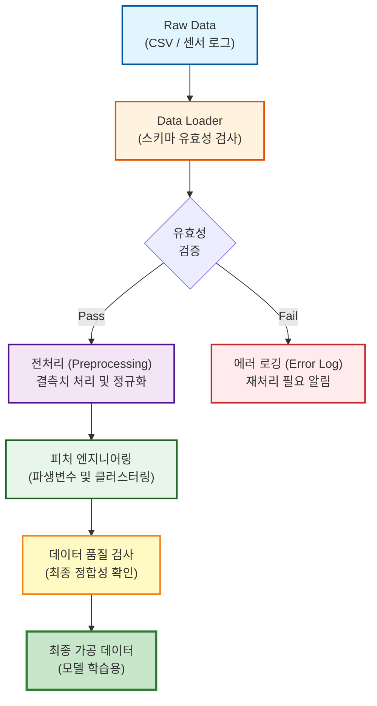

# Wafer Defect Data ETL Pipeline


> **Semiconductor Wafer Defect Detection Data Pipeline**
>
> 반도체 제조 공정의 Raw Data(Log/Sensor)를 수집하여, 결함 탐지 모델이 학습 가능한 형태(Clean Data)로 가공하는 **자동화된 ETL 파이프라인**입니다. 도메인 특성을 반영한 동적 이상치 제거와 엄격한 데이터 타입 검증을 통해 **데이터 정합성(Data Integrity)**을 확보하는 데 초점을 맞췄습니다.

## 🏗️ Pipeline Architecture

데이터의 수집(Ingestion)부터 적재(Load)까지의 흐름을 시각화했습니다.



## 🔥 Key Engineering Challenges & Solutions

데이터 엔지니어링 관점에서 직면한 **데이터 품질 문제(Data Quality Issues)**와 해결 전략입니다.

### 1. Class Imbalance 및 이상치 처리 (Dynamic Outlier Removal)

**Problem**: 반도체 결함 Class별로 데이터 분포가 상이하여, 일괄적인 IQR 적용 시 정상 데이터 손실 발생.

**Solution**: Groupby를 활용한 Class별 동적 IQR 임계값 적용.

**Outcome**: 정상 데이터 손실을 최소화하며 **12,178개(19.06%)**의 노이즈 데이터를 정밀하게 제거.

```python
# Class별 동적 이상치 제거 로직 (Snippet)
for class_id, group in df.groupby("Class"):
    q1, q3 = group[col].quantile([0.25, 0.75])
    iqr = q3 - q1
    if iqr > 0:  # 분산이 있는 경우에만 필터링 수행
        upper_bound = q3 + 1.5 * iqr
        filtered = group[group[col] <= upper_bound]
```

### 2. 데이터 무결성 및 타입 안정성 (Type Safety)

**Problem**: CSV 로드 시 Null 값이 포함된 정수형 컬럼이 Float으로 자동 형변환되거나 문자열로 오인식됨.

**Solution**: Pandas의 `Int64` (Nullable Integer) 타입을 명시적으로 적용하고, 파이프라인 각 단계마다 Schema Validator 도입.

```python
# 예시: nullable 정수형 처리
df["KMeans_Cluster"] = pd.Series(pd.NA, index=df.index, dtype="Int64")
df["KMeans_Cluster"] = df["KMeans_Cluster"].astype("Int64")
```

### 3. 수치 연산 안정성 확보 (Handling Inf/NaN)

**Problem**: 파생 변수(SNR 등) 생성 시 분모가 0이 되어 `inf`(무한대) 값 발생, 모델 학습 에러 유발.

**Solution**: Epsilon(`1e-6`) 추가 및 `np.inf`에 대한 예외 처리 로직 구현.

```python
# 예시: SNR 파생 변수 생성
df["SNR_OFFSET_GL"] = df["MDAT_OFFSET"] / (df["MDAT_GL"] + 1e-6)
df["SNR_OFFSET_GL"] = df["SNR_OFFSET_GL"].replace([np.inf, -np.inf], np.nan)
```

### 4. 파이프라인 실행 로깅 및 모니터링

**Implementation**: Python `logging` 모듈을 활용한 파이프라인 실행 로그 적재. 각 단계별 데이터 처리 현황과 품질 지표를 기록하여 추적 가능성 확보.

## 🛠️ Tech Stack

- **Language**: Python 3.9+
- **Data Processing**: Pandas, NumPy (Vectorized Operations)
- **Machine Learning**: Scikit-learn (K-Means for Labeling)
- **Code Quality**: Type Hinting applied, Modular Design
- **Logging**: Python logging 모듈을 활용한 파이프라인 실행 로그 적재

## 📁 Project Structure

ETL 파이프라인의 유지보수성을 위해 기능별로 모듈을 분리했습니다.

```
Wafer_Defect_Final/
├── src/
│   ├── __init__.py
│   ├── data_loader.py       # 데이터 수집 및 유효성 검사 (Loader Class)
│   └── preprocessing.py     # 결측치/이상치 처리 로직 (Preprocessor Class)
├── processed_data/
│   └── processed_data.csv   # 전처리 완료 데이터
├── main.py                  # 파이프라인 실행 진입점 (Entry Point)
├── requirements.txt         # 의존성 패키지
└── README.md
```

## 📊 Data Quality Report (Result)

파이프라인 실행 후 산출된 데이터 품질 지표입니다.

| Metric | Value | Description |
|--------|-------|-------------|
| Original Rows | 63,909 | 원본 데이터 수 |
| Filtered Rows | 51,731 | 전처리 후 데이터 수 |
| Loss Rate | 19.06% | 노이즈 및 이상치 제거율 |
| Consistency | 100% | 데이터 타입 및 스키마 정합성 |
| Feature Count | 31 | 최종 피처 수 (파생변수 포함) |

## 🚀 How to Run

```bash
# 1. Install Dependencies
pip install -r requirements.txt

# 2. Run ETL Pipeline
python main.py
```

### 모듈별 사용 예시

#### 데이터 로드
```python
from src.data_loader import DataLoader, load_data

# 객체지향 방식
loader = DataLoader()
df = loader.load_raw_data()

# 함수형 방식
df = load_data()
```

#### 데이터 전처리
```python
from src.preprocessing import DataPreprocessor

preprocessor = DataPreprocessor()

# 전체 파이프라인 실행
processed_df = preprocessor.preprocess(df)

# 단계별 실행
cleaned_df = preprocessor.remove_outliers_by_class(df)
df_with_features = preprocessor.add_engineered_features(cleaned_df)
clustered_df = preprocessor.run_kmeans_by_step(df_with_features)
final_df = preprocessor.label_killer_defects(clustered_df)
```

## 📝 주요 파생 변수

1. **SNR_OFFSET_GL**: `MDAT_OFFSET / (MDAT_GL + 1e-6)` - 신호 대 노이즈 비율
2. **SNR_INTENSITY_NOISE**: `INTENSITY / (PATCHNOISE + 1e-6)` - 강도 대 노이즈 비율
3. **ASPECT_RATIO**: `SIZE_X / (SIZE_Y + 1e-6)` - 결함 형태 비율
4. **DENSITY_SIGNAL**: `INTENSITY / (DEFECT_AREA + 1e-6)` - 신호 밀도

## 🔍 데이터 검증 체크리스트

파이프라인 실행 후 다음 사항을 확인하여 데이터 정합성을 보장합니다:

- [ ] 원본 데이터 행 수 대비 처리된 데이터 행 수 비율 확인
- [ ] 각 단계별 컬럼 수 변화 추적
- [ ] Class별 데이터 분포 균형 확인
- [ ] 파생 변수 생성 후 inf/NaN 발생 여부 확인
- [ ] 클러스터링 결과 분포 확인 (각 공정별 클러스터 수)

---

**Built with focus on data integrity and pipeline reliability.**

